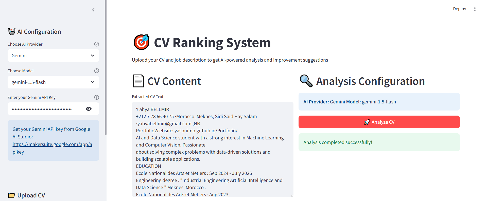
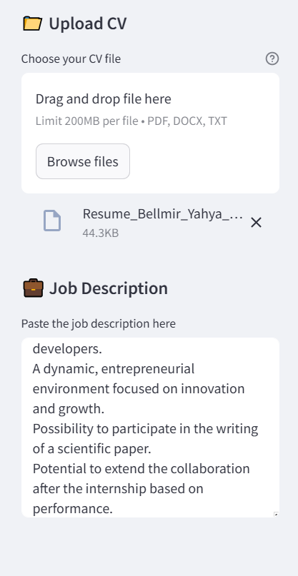
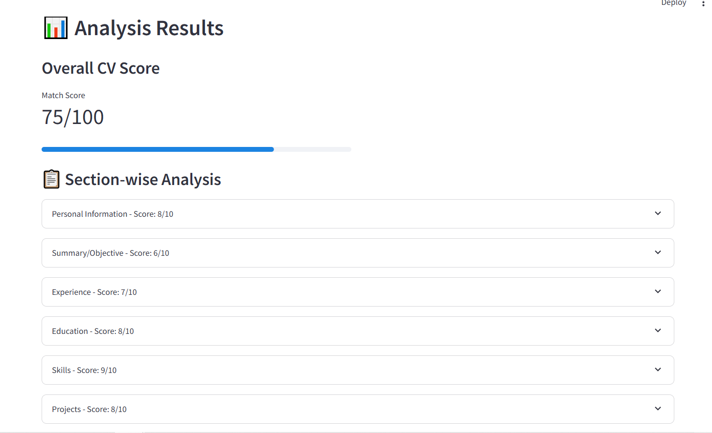
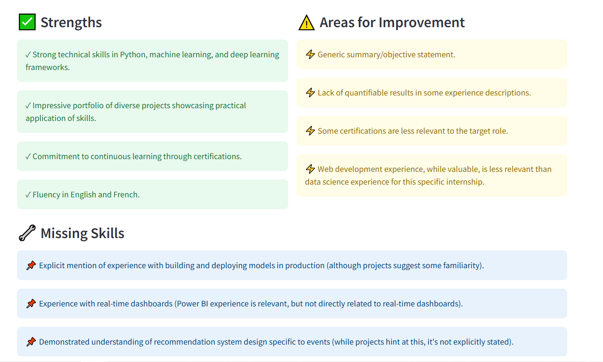

# 🎯 CV Ranking System

A comprehensive AI-powered CV analysis tool that evaluates resumes against job descriptions using multiple AI providers (Gemini, OpenAI GPT, and xAI Grok, Claude, Mistral..). Get detailed feedback, section-wise scoring, and actionable improvement suggestions.


 
# 🌟 Features 

- Multi-AI Provider Support: Choose between Google Gemini, OpenAI GPT, xAI Grok, Claude, Mistral, Preplexity, Together AI and Cohere 
- File Format Support: Upload PDF, DOCX, or TXT files
- Section-wise Analysis: Detailed breakdown of CV sections with individual scores
- Comprehensive Scoring: Overall CV match score against job requirements
- Actionable Feedback: Specific improvement suggestions for each section
- Secure API Key Handling: Users provide their own API keys (not stored)
- Modern UI: Clean, intuitive Streamlit interface
- Real-time Analysis: Instant AI-powered CV evaluation

# 🚀 Quick Start

## Prerequisites

- Python 3.7 or higher
- API key from at least one of the supported providers

## Installation
### Clone or create the project:
```bash
git clone https://github.com/Yasouimo/CV-ranking-system.git
```
### Install required packages:
```bash
pip install -r requirements.txt
```
### Run the application:
```bash
streamlit run cv_ranking_app.py
```

## 🔑 Getting API Keys
### Google Gemini
- Visit Google AI Studio
- Sign in with your Google account
- Click "Create API Key"
- Copy your API key

### OpenAI
- Visit OpenAI Platform
- Sign in to your OpenAI account
- Click "Create new secret key"
- Copy your API key

### xAI (Grok)
- Visit xAI Console
- Sign in with your account
- Navigate to API Keys section
- Generate a new API key

## 📖 Usage Guide
### Step 1: Configure AI Settings
- Select your preferred AI provider (Gemini, OpenAI, or xAI)
- Choose the specific model you want to use
- Enter your API key securely

### Step 2: Upload Your CV
- Option A: Upload a file (PDF, DOCX, or TXT)
- Option B: Copy and paste your CV content directly

### Step 3: Add Job Description
Paste the complete job description including:

- Job requirements
- Required skills
- Responsibilities
- Qualifications

 

### Step 4: Analyze
Click "🚀 Analyze CV" to get comprehensive feedback

 

## 📊 Analysis Output
The system provides:

- Overall Score: Match percentage (0-100)
- Section-wise Analysis: Individual scores for each CV section
- Strengths: What works well in your CV
- Weaknesses: Areas needing improvement
- Missing Skills: Skills mentioned in job description but not in CV
- Recommendations: Specific, actionable improvement suggestions

 

# 🛠️ Technical Details
## Dependencies
```bash
streamlit>=1.28.0
google-generativeai>=0.3.0
openai>=1.0.0
requests>=2.31.0
PyPDF2>=3.0.1
python-docx>=0.8.11
```

## File Processing
- **PDF**: Extracted using PyPDF2
- **DOCX**: Processed with python-docx
- **TXT**: Direct text reading

## Security Features
- API keys are input as password fields (hidden)
- Keys are not stored or logged
- Session-based processing only

# 🔮 Future Enhancements
## Planned features:

- Batch CV processing
- CV comparison functionality
- Export analysis reports
- Integration with more AI providers
- Advanced scoring algorithms
- Industry-specific analysis templates

# Deployement:
To test the app please visit the link below :

[Streamlit app](https://cv-ranking-system.streamlit.app/)

# Contact
- Project Creator : **Bellmir Yahya**
- Github : [Github Link](https://github.com/Yasouimo)
- LinkedIn : [LinkedIn Link](https://www.linkedin.com/in/yahya-bellmir-a54176284/)
- Email : yahyabellmir@gmail.com
